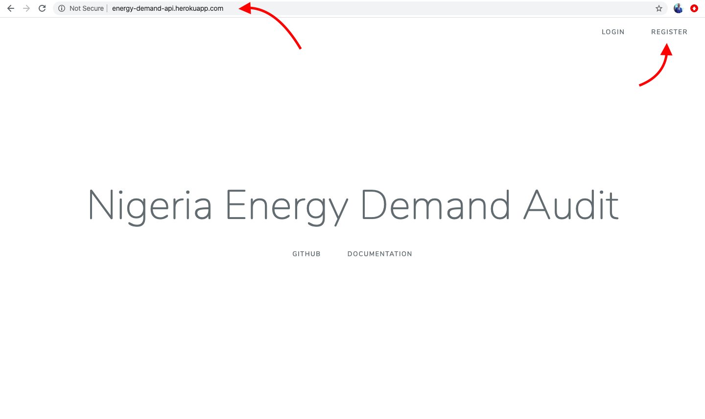
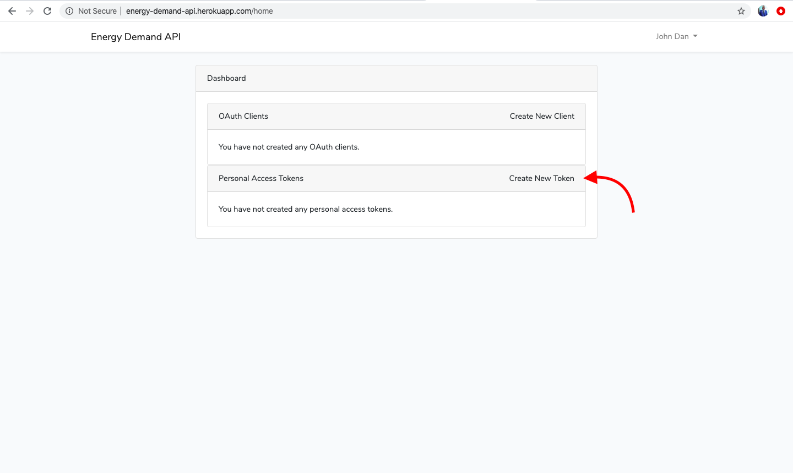
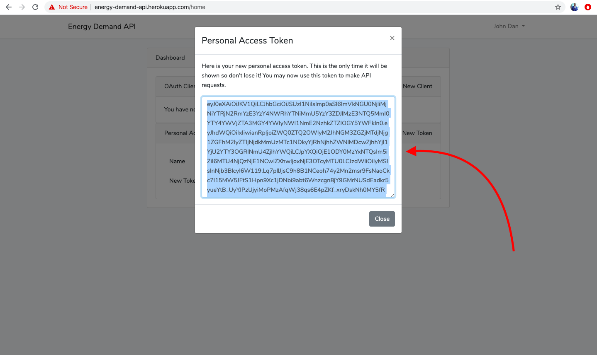
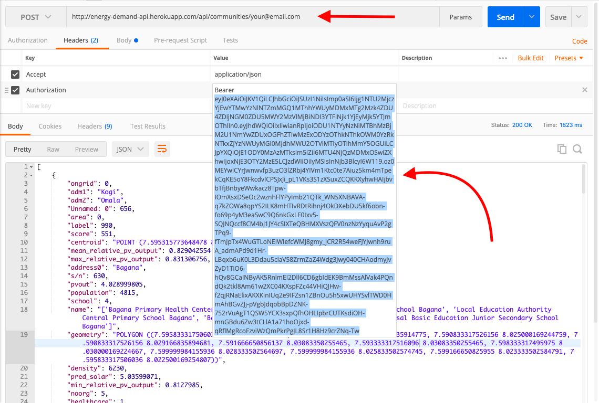
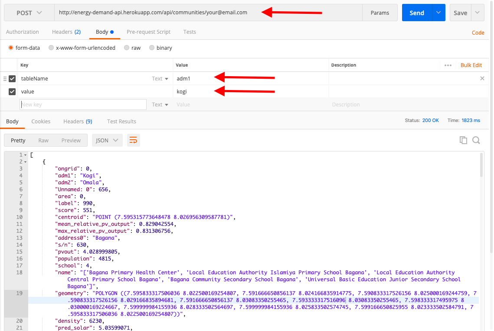
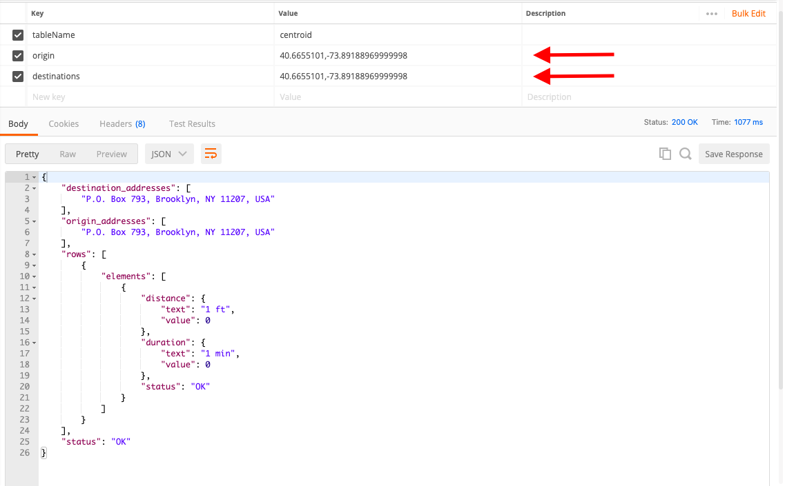

# Nigerian Energy Demand
This API returns JSON arrays of Energy Demand Audit for Rural areas in Nigeria. This locations are 15km away from the National Electricity Gird in Nigeria. They are mostly populations between 4,000 and 10,000 inhabitants. 

## Front Page URL: 
`http://energy-demand-api.herokuapp.com`

**Procedure**
- Register on `http://energy-demand-api.herokuapp.com/register`
- Click on `Create New Token`
- Copy generated Token
- Use the generated Token in the request Headers during the API call to the endpoint. 

## Endpoint URL: 
`http://energy-demand-api.herokuapp.com/api/communities/your@email.address`

**Payload** 
- Headers
    ```
    Accept: 'json/application'
    Authorization: 'Bearer .$Token'
    ```
 - Body
    ```
    Form Data
        tableName: 'adm1'
        value: 'kano'
    ```
    Distance Matrix
     ```
    Form Data
        tableName: 'controid'
        origin: '40.6655101,-73.89188969999998'
        destination: '40.6655101,-73.89188969999998'
    ```
**Pictorial Steps:** 


1. Create Account

2. Click create Token

3. Create Token

4. Copy Token

5. Paste Token

6. Enter Payload Correctly

7. Distance Matrix Sample Payload
